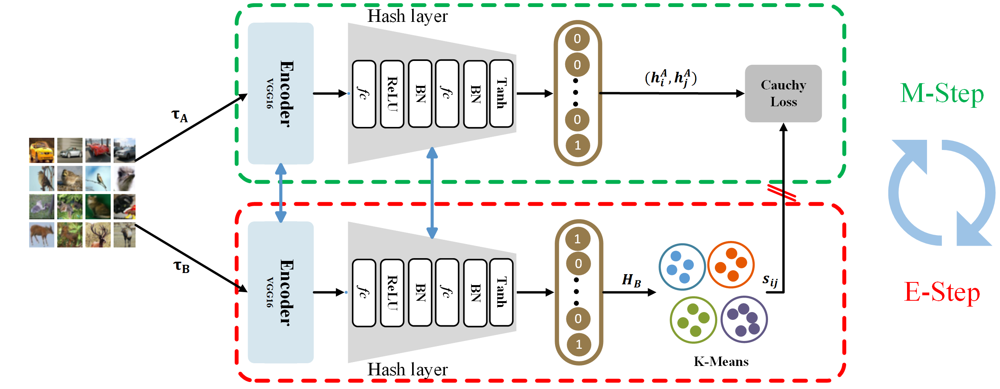

# Introdunction
This is the official implementation of the paper *Deep contrastive hashing with online clustering*.
## Abstrasct
Although contrastive self-supervised learning (SSL) methods can assist in representation learning for unsupervised hashing methods, they rely on *instance discrimination* and ignore *between-instance similarity* for naturally relevant data, resulting in learning with inadequate information. To bridge this deficiency, we incorporate K-Means into the contrastive SSL framework via the online clustering pattern to reveal *between-instance similarity* and boost representation learning ability. As a result, we propose deep contrastive hashing with online clustering (CHOC), a novel contrastive hashing method using both similar and dissimilar information. We explain the learning process of CHOC from an Expectation-Maximization (EM) perspective and elucidate the rationale for introducing clustering approaches in the contrastive hashing framework. Extensive experimental results on three benchmark image datasets demonstrate that CHOC significantly outperforms the state-of-the-art unsupervised/self-supervised methods for image retrieval.


---
## Framework


## Results:
<span style="display:block;text-align:center"></span>
---
<span style="display:block;text-align:center"></span>

---

## Experiment
### environment

<ul>
<li>
Linux
</li>
<li>
pytorch >= 1.8 python>=3.7.5 and the corresponding torchvision, numpy, tqdm, sklearn, etc.
</li>
<li>
NVIDIA GPU 3090ti &nbsp &nbsp CUDA V10.2
</li>
</ul>


<h2>dataset</h2>
<table>
<tr>
<td >dataset</td><td>class_num</td><td>label type</td><td>train</td><td>query</td><td>database</td><td>source</td>
</tr>
<tr>
<td>COCO</td><td>80</td><td>multi</td><td>10000</td><td>5000</td><td>remain</td><td><a href="https://drive.google.com/drive/folders/0B7IzDz-4yH_HOXdoaDU4dk40RFE?resourcekey=0-yXVCpvfmjTx-OBW6PsSMiA">source</a>#</td>
</tr>
<tr>
<td>NUS-WIDE</td><td>21</td><td>multi</td><td>10000</td><td>2100</td><td>remain</td><td><a href="https://drive.google.com/drive/folders/0B7IzDz-4yH_HOXdoaDU4dk40RFE?resourcekey=0-yXVCpvfmjTx-OBW6PsSMiA">source</a>#</td>
</tr>
<tr>
<td>CIFAR-10</td><td>10</td><td>single</td><td>5000</td><td>5000</td><td>remain</td><td><a href="http://www.cs.toronto.edu/~kriz/cifar.html">source</a></td>
</tr>
</table>

* Note that '#' means it is not the official source, for fair comparision, we obtain the dataset from [HashNet](https://github.com/thuml/HashNet/tree/master/pytorch)

---

<h2>train</h2>

```sh
# make sure the working directory is CHOC/src/
python train.py --data_name coco --hash_bit 64 --batch_size 1024 --cluster_num 100 --R 5000

# or you can pre-compute all features with fixed vgg16 (we also provide in ../data/xx/train.pkl)
# here you need to set the data_path (see below)
1. python ../model/pre_model.py --data_path xxxx --data_name coco --batch_size 8 --model vgg16
2. python train.py --data_name coco --hash_bit 64 --batch_size 1024 --cluster_num 100 --R 5000
```

&nbsp;
<h5>data_path settings</h5>
<p style="font-size: small;">if your image_path is: <code>xx/xxx/coco/data/train2014/xxxx.JPEG</code>, then please set data_path : <code>xx/xxx/coco</code></p>
* you can modify the dataloader/data_list.py to adapt to your file path as well.

---

## Visualization:
<span style="display:block;text-align:center"></span>

## Citation
